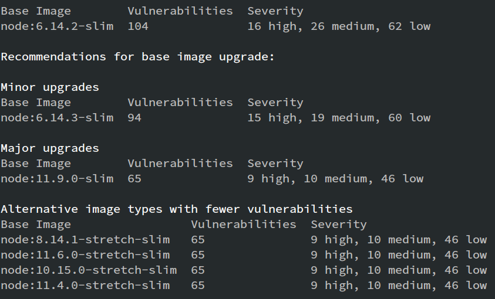
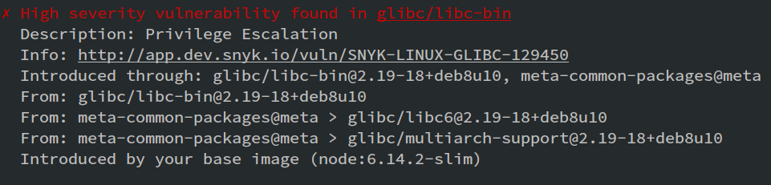
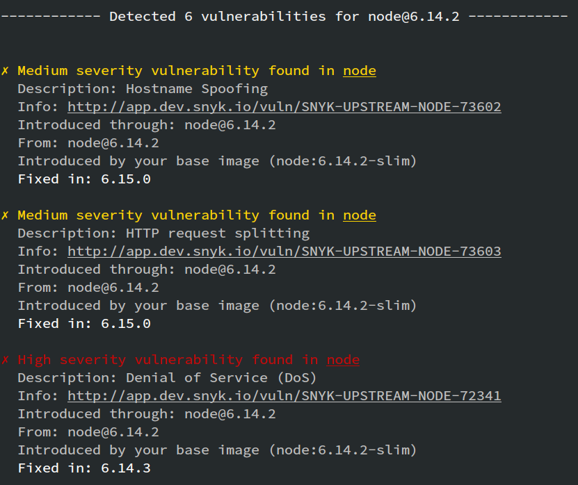
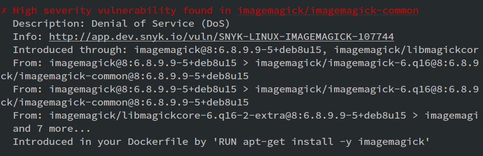

# Docker Goof

Open a terminal at the `docker-goof` directory.

1. Build the image

   ```console
   docker build -t docker-goof .
   ```

2. Test the image

   ```console
   snyk test --docker docker-goof --file=Dockerfile
   ```

All-in-one to clone and run:

```console
git clone git@github.com:snyk/docker-goof && \
cd docker-goof && \
docker build -t docker-goof . && \
snyk test --docker docker-goof --file=Dockerfile
```

## Utility scripts

To build all images:

   ```console
   ./build.sh
   ```

To test all images:

   ```console
   ./test.sh
   ```

## Screenshots

All of these screenshots demonstrate the extra value provided when a
Dockerfile is supplied via the CLI `--file` argument.

For example:

  ```console
  snyk test --docker docker-goof --file=Dockerfile
  ```

### Base Image Remediation

This screenshot shows alternative images that may be used in the Dockerfile's
`FROM` line to reduce vulnerabilities. Minor upgrades are the most likely to
be compatible, Major are potentially breaking depending on how the image is
used, and Alternative architecture images are given for more technical users
to investigate.



### Base Image Vulnerability

This screenshot shows an image with a vulnerability introduced by the base
image (the `FROM` line in a Dockerfile) with the "Introduced by your base
image ..." line



### Binary Vulnerability

This screenshot shows a binary vulnerability; something not managed by the
package manager of the operating system inside the container.



### User-introduced / Dockerfile Vulnerability

This screenshot shows an image introduced by a user in their Dockerfile and
highlights the exact command that introduced the vulnerability, with the
"Introduced in your Dockerfile by ..." line


